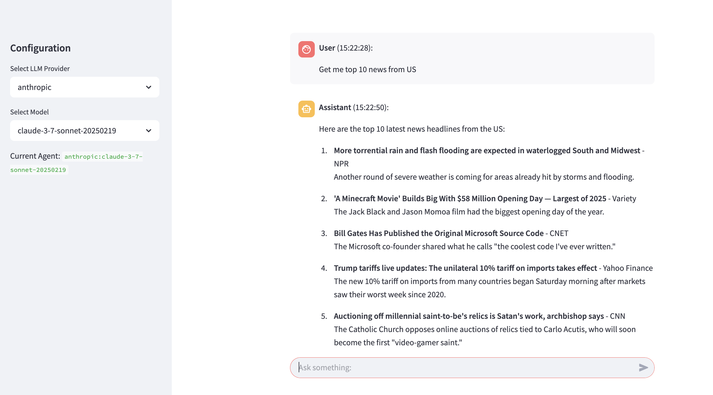
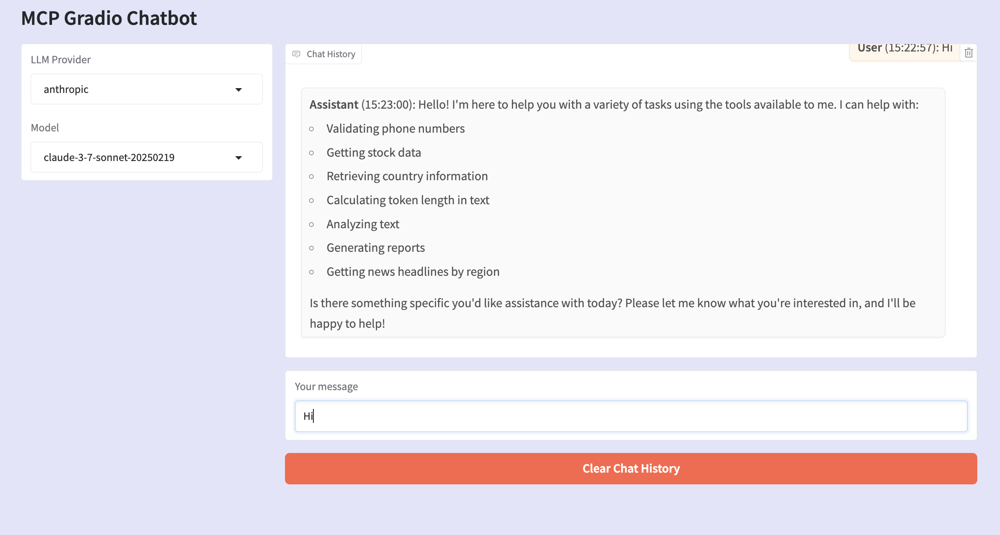
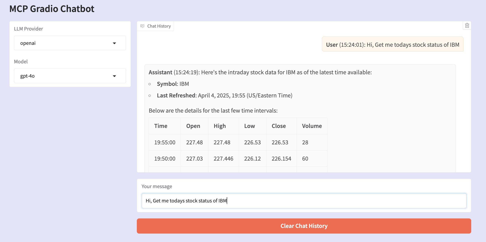

# mcp-multiagent-demo
This repo deals with multiple API built with MCP severs and communication to Chat apps.

# Quick Start

1. Download the repo.
2. Rename .env.example to .env
3. Replace API keys with your own registerd API keys (it's free)
4. Run > docker compose up --build -d

# Test Query

1. Validate phone number 957578787 from India
2. Get me the recent stock details of IBM
3. Analyze text "Your text here"
4. Give me details of India
5. Provide me summary report of "Copy paste some data or table"
6. Get me token count of "your text"

# Examples

Here are some example images from the `images` folder:

